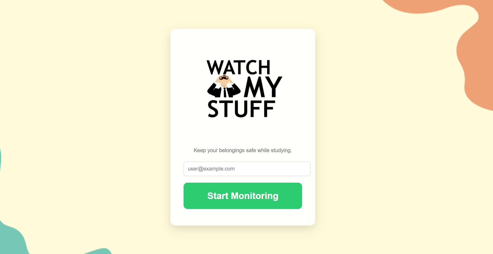
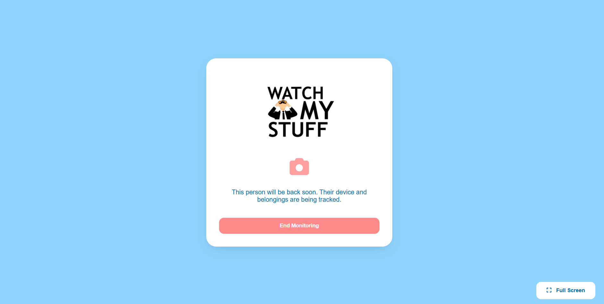
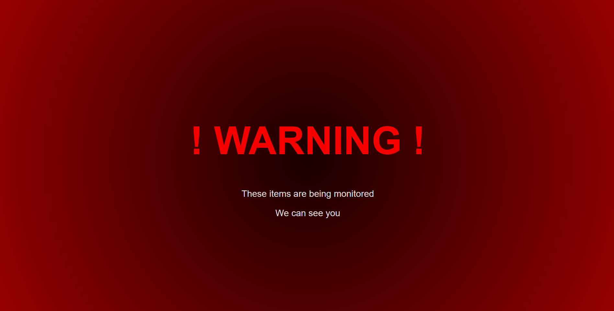
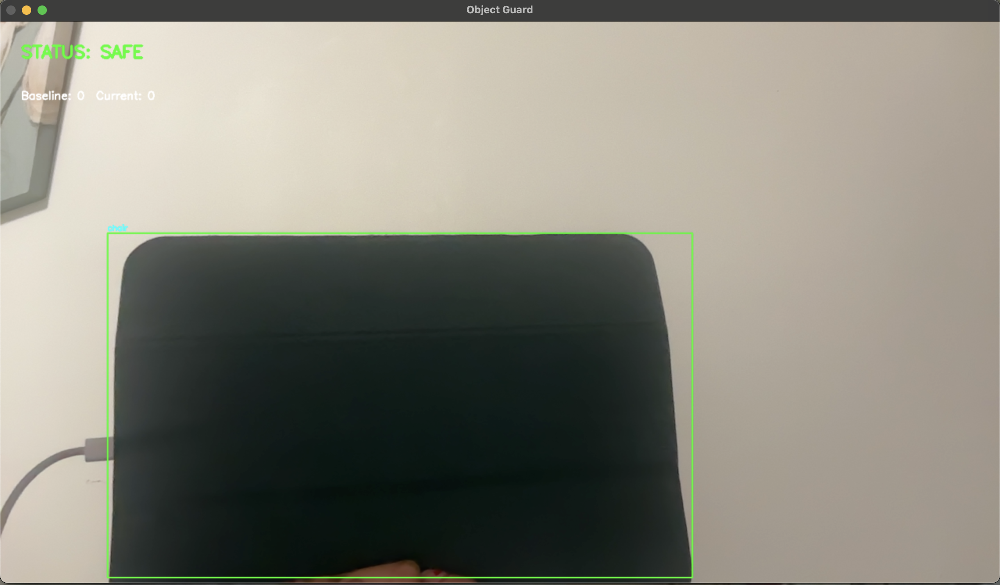
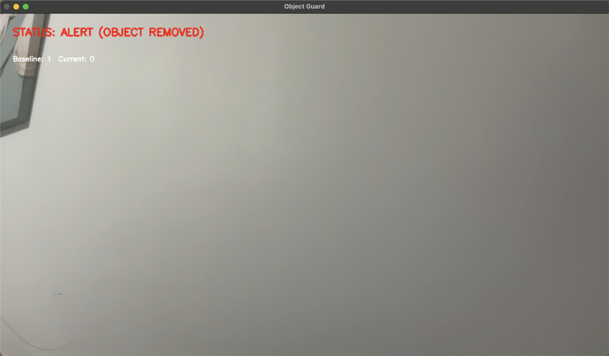

# WatchMyStuff

WatchMyStuff is a computer-vision–powered monitoring system that helps students protect their belongings while studying. Using a laptop webcam, object detection, and instant alerts, WatchMyStuff provides peace of mind when you need to step away for a short break.

---
## Inspiration

Leaving your belongings unattended in a library or study space, even briefly, can be stressful. Asking strangers to watch your items isn’t always comfortable, and it’s often unclear whether something was moved or taken. We built WatchMyStuff to remove this everyday anxiety by automatically monitoring your belongings and alerting you the moment something changes.

---
## How the Project Works

WatchMyStuff is a full-stack system with three main components:

#### 1. Frontend (User Interface)
- Users enter their email to start a monitoring session.
- A 2-digit passkey is generated and shown once to securely end the session.
- While monitoring is active, an idle screen signals that the device and items are being watched.
- If suspicious activity is detected, a warning screen with an audible siren is shown.

#### 2. Backend (Flask API)
- Handles session creation and termination.
- Stores active sessions in MongoDB Atlas.
- Sends email alerts when suspicious activity is detected.
- Acts as a bridge between the frontend and the computer vision system.

#### 3. Computer Vision Monitor (Tracker)
- Runs continuously using OpenCV + YOLOv8.
- Establishes a baseline count of objects in the camera frame.
- Smooths detection noise to avoid false positives.
- Detects when an object is removed from the frame.
- Triggers the backend alert endpoint when a real removal is confirmed.

All components communicate through Flask routes, allowing the system to react in real time.

---
## Project Structure
```
DELTAHACKS-12/
.
│
├── app.py                # Flask backend (API, sessions, email alerts)
├── tracker.py            # Computer vision monitoring script
├── requirements.txt      # Python dependencies
├── README.md             # Project documentation
│
├── templates/             # Frontend HTML pages
│   ├── index.html         # Start monitoring page
│   ├── idle_page.html     # Monitoring-in-progress page
│   └── warning.html       # Alert / deterrence page
│
├── static/                # Static assets
│   ├── logo.png
│   ├── idle_logo.png
│   ├── background.png
│   ├── siren.mp3
│   └── wms_favicon.ico
│
├── images/                # Screenshots for submission/demo
│   ├── camera.png
│   ├── firstPage.png
│   └── secondPage.png
│   └── triggerCamera.png
│   └── triggerPage.png
│
├── yolov8n.pt             # YOLOv8 lightweight model
├── yolov8l.pt             # YOLOv8 large model
└── yolov8s.pt             # YOLOv8 small model
```

---
## Images

First Page


Second Page


Trigger Page


Camera


Triggered Camera


---
## How to Run the Project

#### 1. Prerequisites
- Python 3.9+
- Webcam
- MongoDB Atlas account
- Gmail account (for email alerts)

#### 2. Environment Variables
Create a .env file in the root directory:
```
MONGO_URI=your_mongodb_connection_string
EMAIL_USER=your_email@gmail.com
EMAIL_PASS=your_app_password
```
Use a Gmail App Password, not your real password.

#### 3. Install Dependencies

```
pip install -r requirements.txt
```

#### 4. Start the Backend
```
python app.py
```

The Flask server will run at:
```
http://127.0.0.1:5000
```

---
## Tools & Technologies Used
### Backend
- Python
- Flask
- MongoDB Atlas
- SMTP (Email Alerts)
- Computer Vision
- OpenCV
- YOLOv8 (Ultralytics)

### Frontend
- HTML
- CSS
- JavaScript

### Other
- Requests (API communication)
- dotenv (environment variables)

---
## Built At
DeltaHacks 2026